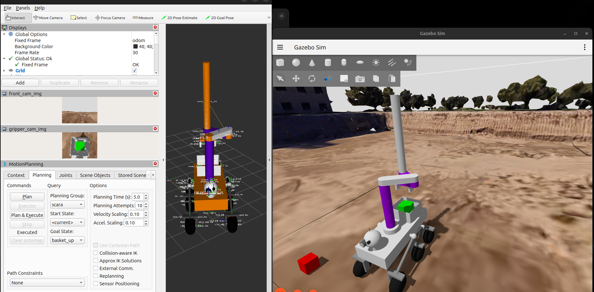

# Practica final. Simulación en ROS2 y Gazebo
***
**Autor**: *Sergio Cobos Blanco*

**Asignatura**: *Modelado y Simulación de Robots*

**Grado**: *Grado En Ingenieria Robótica Software*

**Universidad**: *Universidad Rey Juan Carlos*
***

## Objetivos de la práctica
- Configurar el modelo de un rover (cuyo nombre es *speedy*), modelado en la practica anterior, para que pueda ser utilizado y simulado por ROS2 y Gazebo:
    * Adaptar y dividir el modelo del formato .urdf a ficheros .urdf.xacro
    * Utilización de *ros2_control* y un [fichero de configuración de controladores](speedy_description/config/speedy_controllers.yaml) para la control de las articulaciones móviles en simulación.
    * Configuración de diferentes propiedades de las ruedas para su correcta simulación.

- Simulación en Gazebo del rover:
    * Configurar los ficheros de los [sensores](speedy_description/urdf/sensors) para que puedan ser simulados en Gazebo. Así como la [configuración](speedy_description/config/speedy_bridge.yaml) el nodo bridge de Gazebo.

    * Utilizar el launcher [robot_gazebo](speedy_description/launch/robot_controllers.launch.py) para lanzar:
        - Gazebo
        - rviz2
        - [Modelo del robot](speedy_moveit_config/config/rsp.launch.py)
        - Spawner del robot en gazebo
        - Gazebo bridge para el sensor IMU
        - Gazebo image bridges para las imágenes de las cámaras
        - *twist_stamper* para enviar los comandos de /cmd a simulación

    * Utilizar el launcher [robot_controllers](speedy_description/launch/robot_controllers.launch.py) para lanzar los controladores de las ruedas, el brazo y el gancho del brazo.

- Control del brazo con [Moveit](https://moveit.picknik.ai/main/index.html)

***

## Modelo del robot
El modelo del robot esta descrito en el fichero [speedy.urdf.xacro](speedy_descritpion/robots/speedy.urdf.xacro), teniendo subdivididas sus partes en los ficheros que se encuentran en los directorios de directorio [urdf](speedy_description/urdf) del paquete [speedy_description](speedy_description).

Utilizando `rviz2` podemos visualizar el modelo del robot, sin necesidad de simularlo, y sus links publicadas en el sistema de `tf` gracias al nodo `robot_description_publisher`, el cual también publica el URDF generado a partir del fichero [speedy.urdf.xacro](speedy_descritpion/robots/speedy.urdf.xacro) en el topic `/robot_description`.

Pero para poder visualizar los links unidos a joints moviles, y sus  hijos, es necesario que se publique información relevante sobre estos joints en el topic `/joint_states`. Para ello, se debe utilizar el nodo `joint_state_publisher_gui`, que no solo publicará esta información, si no que también nos brindará una interfaz para controlarlos.

<div align="center">
    
    
</div>

En el PDF [tf_tree](media/tf_tree.pdf) podemos encontrar el arbol generado con el nodo `view_frames` de `tf2_tools`.

***

## Simulación del rover. Pick and place.
En la práctica se pide que el robot realice un pick and place de un cubo que se encuentra a 5 metros del robot.

La simulación se hace en el mundo **urjc_excavation_msr** que se encuentra en el repositorio [urjc-excavation-world](https://github.com/juanscelyg/urjc-excavation-world).

Para lanzar la simulación hay que lanzar los siguientes launchers y nodos uno detrás de otro en terminales diferentes:
1. Para lanzar el modelo del robot, rviz2 y la simulación (Gazebo, spawner del robot,...):
```
ros2 launch speedy_description robot_gazebo.launch.py
```
2. Nodo principal de planificación y control de movimiento de Moveit:
```
ros2 launch speedy_moveit_config move_group.launch.py
```
3. Controladores de las articulaciones:
```
ros2 launch speedy_description robot_controllers.launch.py
```

Una vez se haya realizado este proceso de forma correcta, podemos empezar el proceso pedido desde esta situación:


Todos las posiciones predefinidas que se van a nombrar se encuentran en el fichero [srdf](speedy_moveit_config/config/speedy.srdf) del paquete de Moveit.

La secuencia realizada sería la siguiente:
1. Speedy coloca el brazo en la posición `front_up` para poder aprovechar la cámara del gripper al acercarse al cubo, sin que el robot pierda visión frontal. Esto con el fin de ir orientando aproximadamente el robot para el proceso de **pick**.

2. El robot se acerca al cubo y se pone en una posición que en principio parece correcta para el proceso de **pick**.


3. Se baja la articulación prismática de brazo hasta una posición casi a la altura de `front_pick`, pero sin llegar a poder tocar el cubo con la punta de los dedos del gripper. Así, podremos corregir la posición del robot con mayor precisión para realizar la acción **pick**, ya que tendremos la camara del gripper mucho más cerca del grupo. Estas correcciones se harán teleoperando las ruedas con velocidades bajas y haciendo ligeras modificaciones en los ángulos de las 3 articulaciones de tipo revolute del brazo.

4. Se lleva el brazo a la posición `front_pick` y el gripper a la posición `closed`, para coger el cubo.


5. Se vuelve a subir el brazo hacia arriba, a la posición `front_up`, pero esta vez con el cubo agarrado.


6. Se mueve el brazo hasta el paso intermedio `left_up`.


7. Se mueve el brazo a la posición `basket_up`, donde el robot estará listo para empezar el proceso de **place**.


8. Se baja el brazo a la posición `basket`. En esta posición se soltara el cubo, ya que cuando el brazo esté en esta posición el gripper volvera a la posición `open`.


9. Finalmente se devuelve el brazo a la posición `basket_up`.



Ahora pasaremos a analizar 3 gráficas que nos ayudarán a entender el desempeño del robot en la tarea a realizar.

#### TIEMPO vs POSICIÓN DE CADA RUEDA


Antes de analizar los movimientos realizados por la base en función de la posición de cada rueda, conviene destacar que, para la tarea ejecutada, la base solo necesitó desplazarse hacia delante, sin realizar maniobras significativas adicionales.

Los primeros 10 segundos el robot no se mueve en el espacio, ya que lo que hace es preparar el 