# Practica final. Simulación en ROS2 y Gazebo
***
**Autor**: *Sergio Cobos Blanco*

**Asignatura**: *Modelado y Simulación de Robots*

**Grado**: *Grado En Ingenieria Robótica Software*

**Universidad**: *Universidad Rey Juan Carlos*
***

## Objetivos de la práctica
- Configurar el modelo de un rover (cuyo nombre es *speedy*), modelado en la practica anterior, para que pueda ser utilizado y simulado por ROS2 y Gazebo:
    * Adaptar y dividir el modelo del formato .urdf a ficheros .urdf.xacro
    * Utilización de *ros2_control* y un [fichero de configuración de controladores](speedy_description/config/speedy_controllers.yaml) para la control de las articulaciones móviles en simulación.
    * Configuración de diferentes propiedades de las ruedas para su correcta simulación.

- Simulación en Gazebo del rover:
    * Configurar los ficheros de los [sensores](speedy_description/urdf/sensors) para que puedan ser simulados en Gazebo. Así como la [configuración](speedy_description/config/speedy_bridge.yaml) el nodo bridge de Gazebo.

    * Utilizar el launcher [robot_gazebo](speedy_description/launch/robot_controllers.launch.py) para lanzar:
        - Gazebo
        - rviz2
        - [Modelo del robot](speedy_moveit_config/config/rsp.launch.py)
        - Spawner del robot en gazebo
        - Gazebo bridge para el sensor IMU
        - Gazebo image bridges para las imágenes de las cámaras
        - *twist_stamper* para enviar los comandos de /cmd a simulación

    * Utilizar el launcher [robot_controllers](speedy_description/launch/robot_controllers.launch.py) para lanzar los controladores de las ruedas, el brazo y el gancho del brazo.

- Control del brazo con [Moveit](https://moveit.picknik.ai/main/index.html)

***

## Modelo del robot
El modelo del robot esta descrito en el fichero [speedy.urdf.xacro](speedy_descritpion/robots/speedy.urdf.xacro), teniendo subdivididas sus partes en los ficheros que se encuentran en los directorios de directorio [urdf](speedy_description/urdf) del paquete [speedy_description](speedy_description).

Utilizando `rviz2` podemos visualizar el modelo del robot, sin necesidad de simularlo, y sus links publicadas en el sistema de `tf` gracias al nodo `robot_description_publisher`, el cual también publica el URDF generado a partir del fichero [speedy.urdf.xacro](speedy_descritpion/robots/speedy.urdf.xacro) en el topic `/robot_description`.

Pero para poder visualizar los links unidos a joints moviles, y sus  hijos, es necesario que se publique información relevante sobre estos joints en el topic `/joint_states`. Para ello, se debe utilizar el nodo `joint_state_publisher_gui`, que no solo publicará esta información, si no que también nos brindará una interfaz para controlarlos.

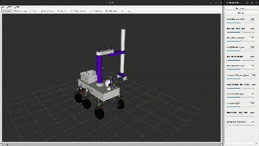

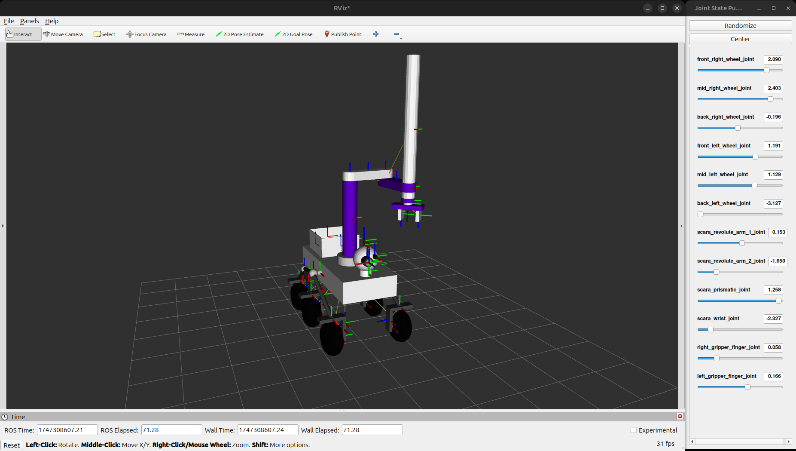

En el PDF [tf_tree](media/tf_tree.pdf) podemos encontrar el arbol generado con el nodo `view_frames` de `tf2_tools`.

***

## Simulación del rover. Pick and place.
En la práctica se pide que el robot realice un pick and place de un cubo que se encuentra a 5 metros del robot.

La simulación se hace en el mundo **urjc_excavation_msr** que se encuentra en el repositorio [urjc-excavation-world](https://github.com/juanscelyg/urjc-excavation-world).

Para lanzar la simulación hay que lanzar los siguientes launchers y nodos uno detrás de otro en terminales diferentes:
1. Para lanzar el modelo del robot, rviz2 y la simulación (Gazebo, spawner del robot,...):
```
ros2 launch speedy_description robot_gazebo.launch.py
```
2. Nodo principal de planificación y control de movimiento de Moveit:
```
ros2 launch speedy_moveit_config move_group.launch.py
```
3. Controladores de las articulaciones:
```
ros2 launch speedy_description robot_controllers.launch.py
```

Una vez se haya realizado este proceso de forma correcta, podemos empezar el proceso pedido desde esta situación:
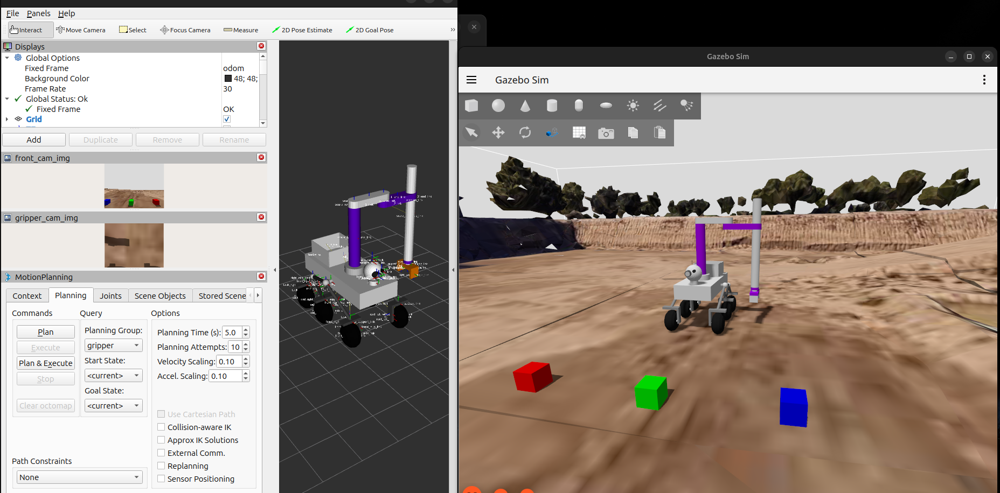

Todos las posiciones predefinidas que se van a nombrar se encuentran en el fichero [srdf](speedy_moveit_config/config/speedy.srdf) del paquete de Moveit.

### Secuencia de pick and place

La secuencia está grabada en el siguiente rosbag: https://drive.google.com/file/d/1Zt9C5sO8J7pZEfB5tyxRAEEe5ohIPaRO/view?usp=sharing

##### Paso 1
Speedy coloca el brazo en la posición `front_up` para poder aprovechar la cámara del gripper al acercarse al cubo, sin que el robot pierda visión frontal. Esto con el fin de ir orientando aproximadamente el robot para el proceso de **pick**.

##### Paso 2
El robot se acerca al cubo y se pone en una posición que en principio parece correcta para el proceso de **pick**.


##### Paso 3
Se baja la articulación prismática de brazo hasta una posición casi a la altura de `front_pick`, pero sin llegar a poder tocar el cubo con la punta de los dedos del gripper. Así, podremos corregir la posición del robot con mayor precisión para realizar la acción **pick**, ya que tendremos la camara del gripper mucho más cerca del grupo. Estas correcciones se harán teleoperando las ruedas con velocidades bajas y haciendo ligeras modificaciones en los ángulos de las 3 articulaciones de tipo revolute del brazo.

##### Paso 4
Se lleva el brazo a la posición `front_pick` y el gripper a la posición `closed`, para coger el cubo.

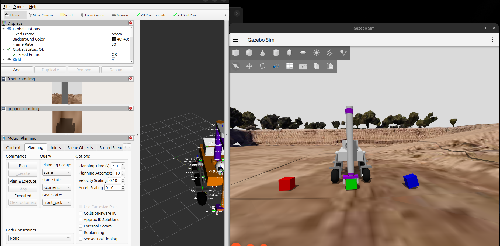

##### Paso 5
Se vuelve a subir el brazo hacia arriba, a la posición `front_up`, pero esta vez con el cubo agarrado.

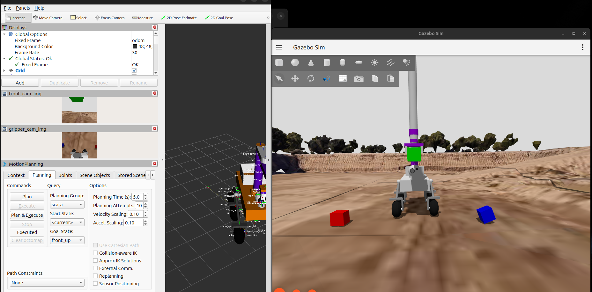

##### Paso 6
Se mueve el brazo hasta el paso intermedio `left_up`.

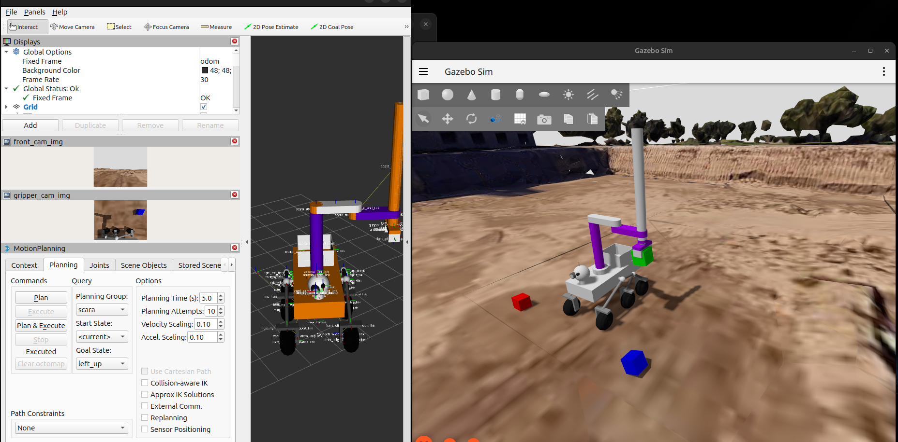

##### Paso 7
Se mueve el brazo a la posición `basket_up`, donde el robot estará listo para empezar el proceso de **place**.

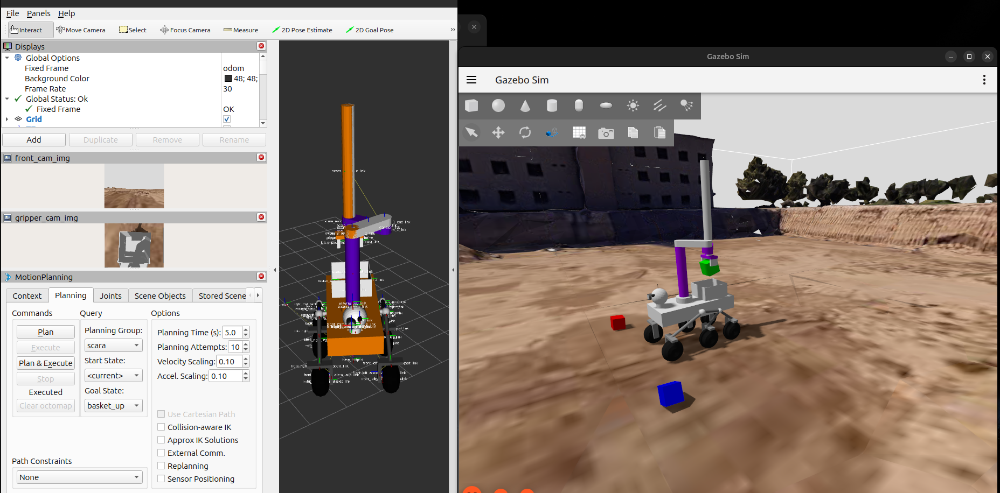

##### Paso 8
Se baja el brazo a la posición `basket`. En esta posición se soltara el cubo, ya que cuando el brazo esté en esta posición el gripper volvera a la posición `open`.

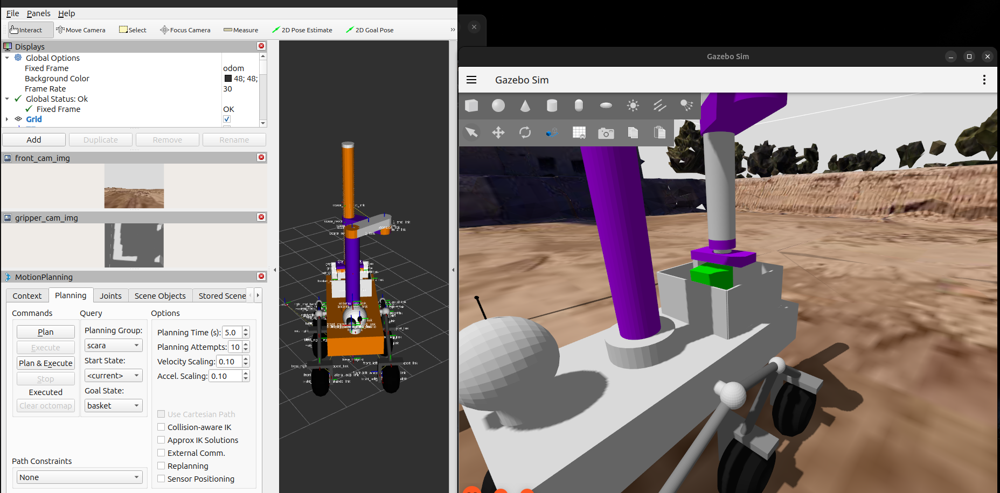

Ahora pasaremos a analizar 3 gráficas que nos ayudarán a entender el desempeño del robot en la tarea a realizar.

#### TIEMPO vs POSICIÓN DE CADA RUEDA

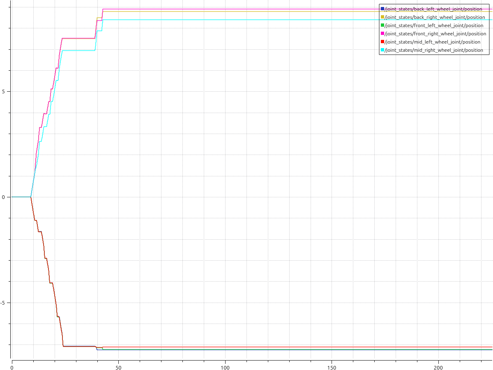

Un aspecto a tener en cuenta es que por la orientación de los frames de las ruedas y de la [configuración del controlador de la base](speedy_description/config/speedy_controllers.yaml#43), cuando la base se mueve hacia adelante, la posición de las ruedas de la derecha incrementa y la de las de la izquierda decrementa, pero realmente giran en el mismo sentido.

Los primeros 10 segundos el robot no se mueve en el espacio, ya que, a parte de un par de segundos en los que no sucede nada, lo que hace es preparar el brazo, basicamente el [paso 1](#paso-1) de la secuencia.

Luego podemos ver un crecimiento (y decremento para las ruedas de la izquierda) de la posición muy rápido durante aproximadamente 15 segundos, esto debido que el robot [se acerca a la caja](#paso-2). Además, las ruedas de la derecha acaban en una posición más grande a las de la izquierda. Básicamente, estas ruedas se han movido más, lo que nos indica que el movimiento no ha sido recto hacia delante, se ha ido girando ligeramente, ya que en el mismo lapso de tiempo se han llegado a posiciones distintas en los dos lados. Esto es porque no estaba completamente alineado el robot con el cubo.

Se puede apreciar que el robot se mantiene quieto durante otros 15 segundos. Esto sucede porque se empieza a realizar el [tercer paso](#paso-3).

Luego, se hacen unos pequeños movimientos para poder preparar el robot para realizar el movimiento de **pick**. Estos movimientos se realizan en aproximadamente 5 segundos (el ultimo tramo de crecimiento), que es claramente un giro hacia la izquierda, ya que este incremento se puede ver en las ruedas de la derecha y es minúsculo en las de la izquierda.

La base ya no realiza más movimientos, por lo que no hay más cambios en la gráfica a lo largo del tiempo.

### TIEMPO VS ACELERACIÓN DE TODAS LAS RUEDAS

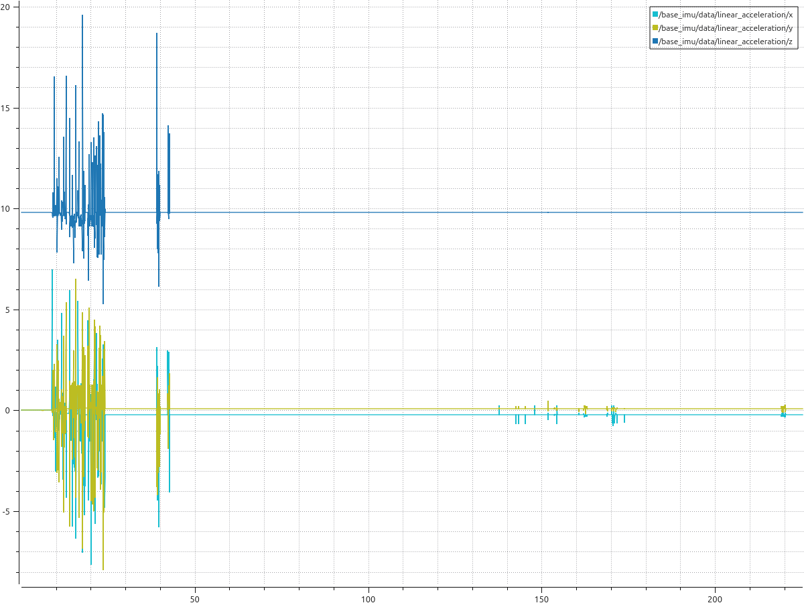

Esta gráfica, la obtenemos a partir de los datos del sensor IMU colocado en el centro de la base. En específico, son los datos de aceleración linear en los 3 ejes:
```
Eje x: Azul claro
Eje y: Verde
Eje z: Azul oscuro
```
El analisis del inicio esta gráfica concuerda perfectamente con el movimiento descrito en los pasos [2](#paso-2) y [3](#paso-3) de la secuencia de acciones, además de lo descrito en el principio de la gráfica y el análisis de la posición de las ruedas. En la gráfica de la posición podemos ver como hay parones muy pequeños y el movimiento no es una recta perfecta, lo que causa picos de aceleración durante estos dos movimientos iniciales.

Podemos observar que la aceleración en el eje Z es, excepto en los picos, un valor muy cercano a 10. Este valor es, claramente, la aceleración gravitatoria (9.8).

Esos pequeños picos de aceleración que se dan a lo largo de la segunda mitad seguramente se deban a los movimientos realizados por el brazo, que hagan que la base note pequeños picos de aceleración. Pero estos no son provocados por las ruedas.

### TIEMPO VS G-PARCIAL

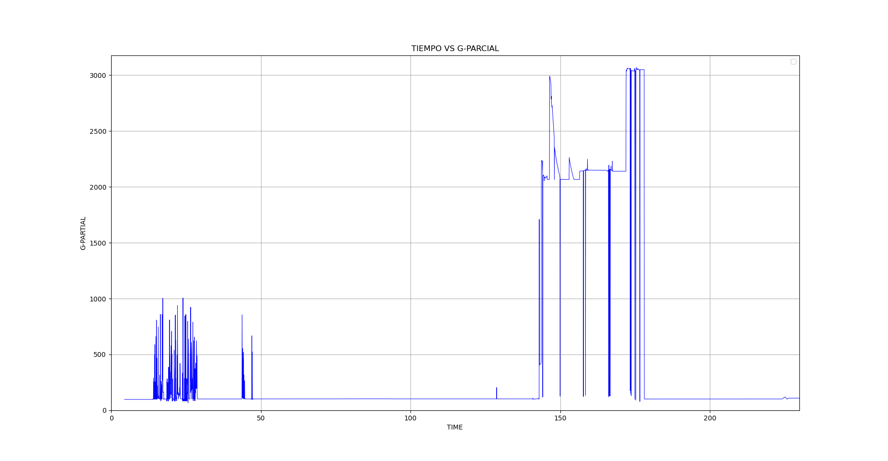

Esta gráfica representa el gasto parcial del brazo, y se obtiene a partir del sumatorio de las fuerzas de par motor aplicadas en cada articulación movil del brazo.

La desglosaremos en diferentes partes:

#### Movimientos iniciales
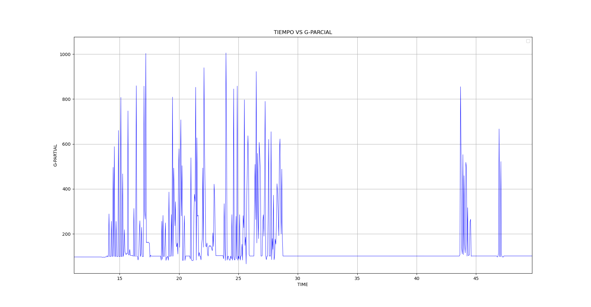

La primera parte de picos empieza desde que se realiza el [paso 1](#paso-1), donde se lleva el brazo a la `front_up`, hasta que el robot para de moverse durante el [paso 2](#paso-2). Tiene sentido que el robot necesite aplicar fuerzas durante el movimiento de la base, y no solo al cambiar el brazo de posición, ya que la articulación prismática se debe mantener en la misma posición durante estos picos de aceleración que hemos visto en la gráfica obtenida con el sensor IMU.

Los picos del final de esta parte de la gráfica se dan debido al [paso 3](#paso-3) ya que se baja el brazo de forma controlada, por eso se necesita utilizar fuerza de la articulación prismática.

#### Pick and place
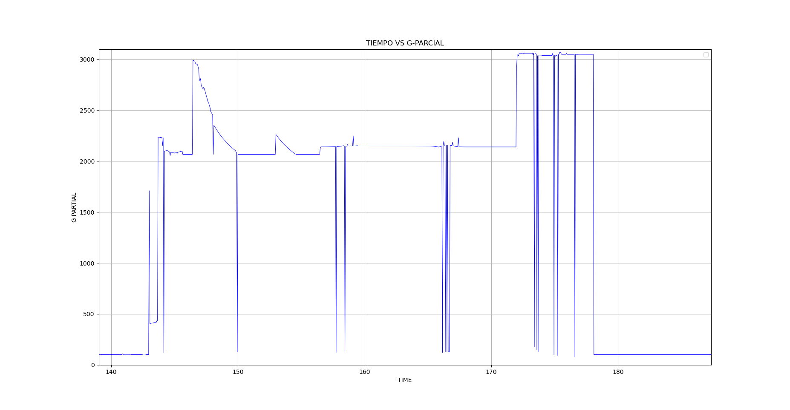

Esta parte de la grafica representa las fuerzas aplicadas durante todo el proceso de **pick and place**.

También la desglosaremos en pequeñas partes:

#### Pick
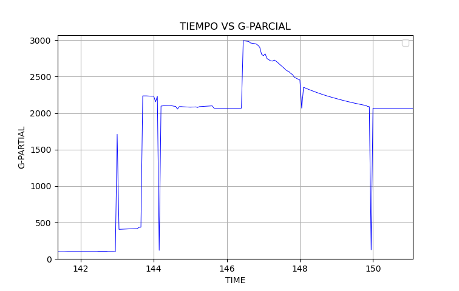

*Nota: Los intervalos de segundos son aproximados.*

+ **Segundos 143 -> 143.6:** Seguramente corresponda al momento en el que se [baja el brazo a la posicion `front_pick`](#paso-4).

+ **Segundos 143.6 -> 146.5:** Aquí el gripper [pasa al estado `closed`](#paso-4), y a lo largo del proceso de **pick and place** se mantendrá como gasto parcial mínimo la suma de las fuerzas aplicadas por los dedos del gripper para mantener sujeto el cubo. Hay picos de bajada momentaneos, que se darán debido a la simulación.

+ **Segundos 146.5 -> 150:** Aquí [se lleva el brazo a `front_up` con el cubo sujeto](#paso-5), por lo que tiene sentido que la fuerza aplicada por la articulación prismática haga que aumente el gasto parcial durante este proceso. Fuerza que claramente disminuye a lo largo del movimiento, ya que se va necesitando menos para realizarlo.

#### Del frente a la cesta
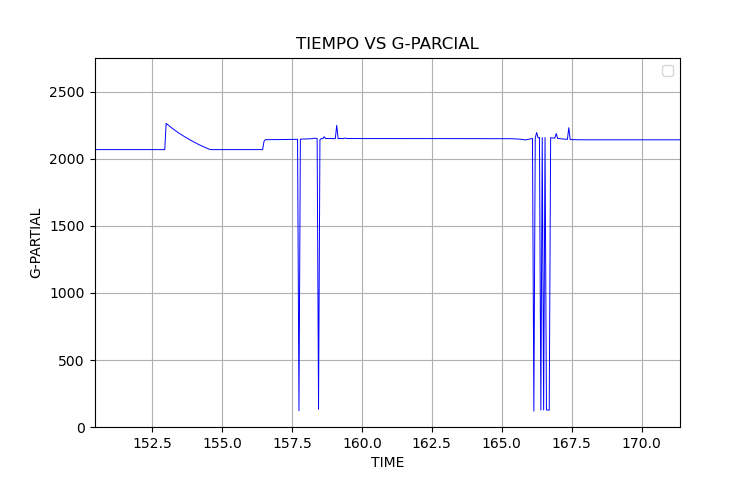

Podemos ver un pico amortiguado inicial, debido a que [se lleva el robot al punto intermedio](#paso-6). Y luego podemos observar como no solo aumenta levemente el gasto parcial por los [movimientos que tendrá que realizar con las tres ariculaciones de tipo `revolute`](#paso-7) para preparar la acción place, si no que esos movimientos provocan ciertos picos erráticos en el gasto parcial.

#### Place
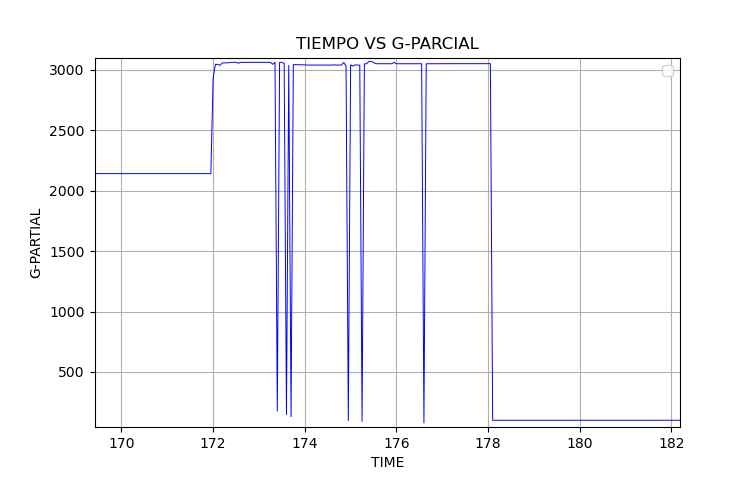

Por ultimo el movimiento de place. Aquí sucede todo lo explicado en el [paso 8](#paso-8). Aquí se debe sujetar el cubo, se debe apollar en la base del robot (dentro de la cesta), y se debe soltar. Todo esto conlleva movimientos controlados, aplicar presión y sujetar el cubo, por eso tiene gastos parciales tan altos.